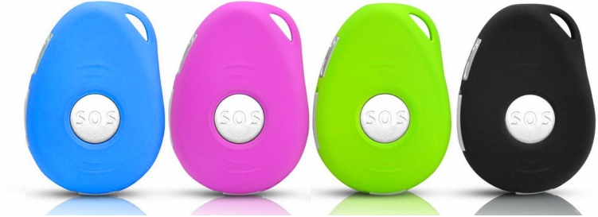
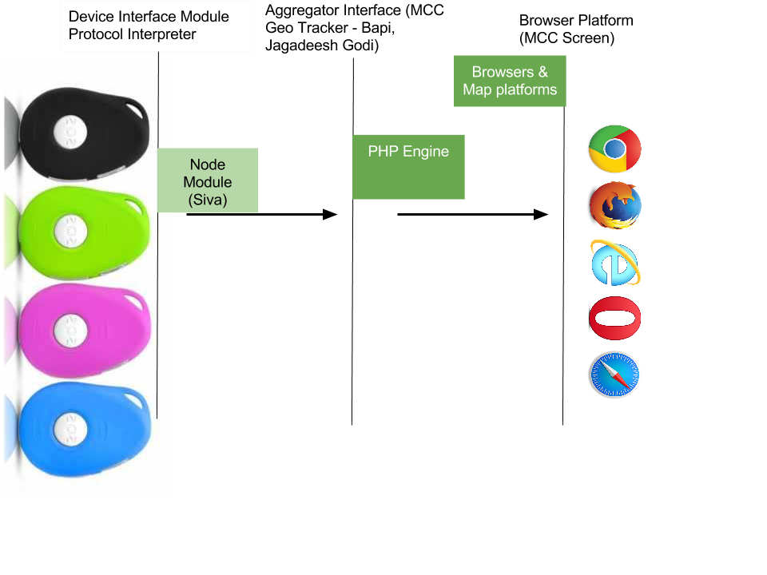

## SOS Device Interpreter Server - Callhealth Proprietory

### Basic Overview of this module
This module is a middleware between MCC Officers tracker and the SOS devices. MCC officer tracking is available already but the SOS device integration - which is aimed at addressing emergency situations and if the officer's phone is lost - is handled by this current module - "SOS Officer details mapping"


### Machine Details where deployed

```Local IP: 100.72.0.15
External IP: 104.211.231.211
Port: 5062```


**Important**
The public IP is accessible over internet - This is required for Devices installed with SIM cards to contact our server to ping any information. Make sure this public IP is static, otherwise whenever the IP is changed, the IP must be configured in all devices. 
(That is a manual process of sending a set of SMSes to each device and confirm the settings are configured. That is a lot of work.)

### Technologies incorporated
Node JS - Standalone Web server.

The module instantiates Socket on the server for a device whenever a device hits this server on port 5062. The server keeps that connection tied up with that device as long as it is ON.

A Connection per device is maintained - But that is as long as the process is alive. No persistence of any sort is incorporated. The logic of officer mapping and storing and tracking history need to be taken care by existing MCC geotracker modules if required, and only the device lat long and the situation (Normal when normal, and Emergency when pressed SOS button) is delegated to the MCC geo tracker module.

That said, this module is JUST the interface between all SOS devices in public cloud to Callhealth MCC geo tracker server.


### Bird View of Application

